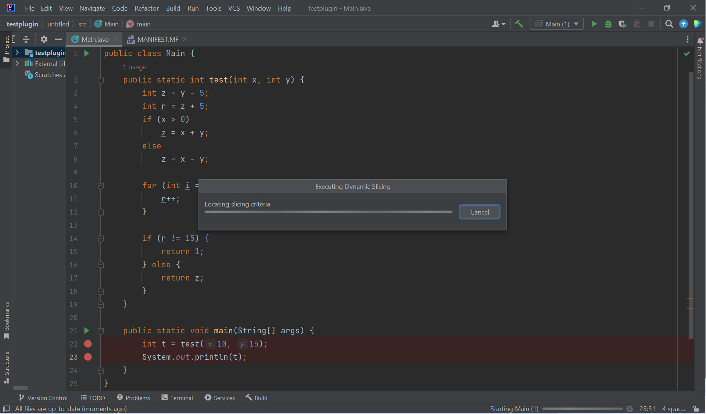

<h1 align="center">Slicer4D: Slice-based debugging for IntelliJ</h1>

This plugin integrates dynamic slicing into the existing IntelliJ IDE Debugger. 

Instructions to add custom slicer- [here](#add-custom-slicer) \
JSON template to upload slice file- [here](sliceTemplate.json)

PS: This tool is only accurate for deterministic programs 

## 1. Prerequisites
- Ensure that you have [Graphviz](https://graphviz.org/) installed.
- We recommend gaining familiarity with slice-based debugging and dynamic analysis. 

## 2. Setup
- Clone this repository. 
- Open it as a new project in IntelliJ IDE 
- Ensure the 'Run Plugin' run configuration is selected and run it by pressing on the green run button in the toolbar.
- IntelliJ will prompt you to create a new project, or will open up an existing project in a new window, which is an IDE instance with the plugin running live. 

## 3. Using Slicer4D
- Right-click on a buggy line in the source code editor and select the "Start slicing from this line" option in the pop-menu to select it as the slicing criterion. 

- The IDE begins executing the dynamic slicing as shown below, with the progress bar.

- Once the program slice is computed, the IDE starts a new debugging session and grays out program statements that are not in the slice in the source code viewer. A new breakpoint will be added to the first slice line if it does not already exist. At this point, one can no longer add breakpoints to non-slice lines ie. grayed out lines. A new Slicer4D instance opens to control the new debugging session.

- The user can press any of the Slicer4D Actions including Step Over, Step Into, Run to Cursor etc. to execute the program slice. These actions will behave similarly to the traditional debugger, with the difference that it only navigate through the program slice. 

## 4. Architecture 

### 4.1 `DynamicSliceDebuggerRunner`
Located at: [src/main/kotlin/ca/ubc/ece/resess/execute/DynamicSliceDebuggerRunner](https://github.com/resess/2023_Slicer4Debugging/blob/main/slicer4D/src/main/kotlin/ca/ubc/ece/resess/execute/DynamicSliceDebuggerRunner.kt)

This component is for starting a new debugging session. In the original debugger, the `GenericDebuggerRunner` is used for starting debugging sessions. The `DynamicSliceDebuggerRunner`  is a subclass of the original `GenericDebuggerRunner` with has two differences:
- has an extra step for running dynamic slicing. The timing for running dynamic slicing must be after the program is compiled and before the debuggee JVM is started.
- creates `DppJavaDebugProcess` instead of `JavaDebugProcess`. The `DppJavaDebugProcess` object defines our own handlers for handling debug commands.

The figure below summarizes the process to start a debugging session with dynamic slicing in Slicer4D.The difference with the original `GenericDebuggerRunner` is highlighted in red.

### 4.2 `JavaSlicer`
Located at: [src/main/kotlin/ca/ubc/ece/resess/slicer/JavaSlicer.kt](https://github.com/resess/2023_Slicer4Debugging/blob/main/slicer4D/src/main/kotlin/ca/ubc/ece/resess/slicer/JavaSlicer.kt)

`JavaSlicer` is a wrapper class of Slicer4J that converts Slicer4J APIs to ones that are more friendly for other components in Slicer4D. It currently has the following interface:
- `instrument`: takes an `ExecutionEnvironment` from the IDE, extracts the paths to the compiled executables (`.class` files or `JAR` files), instruments the executables, and returns paths to the instrumented files.
- `collectTrace`: executes the instrumented files returned by instrument and collects the trace of execution. Returns the trace.
- `createDynamicControlFlowGraph`: takes the trace and the original program to create a `DynamicControlFlowGraph` which is a graph containing all the potential dependencies in the trace. Returns the graph.
- `locateSlicingCriteria`: locates the slicing criteria provided by the user in the `DynamicControlFlowGraph`. Returns a list of statements in the graph.
- `slice`: takes the `DynamicControlFlowGraph` and the location of the slicing criteria in the graph to slice the program. Returns the slice.

PS. Slicer4J has been included as an internal dependency

### 4.3 `DebugController`
Located at: [src/main/java/ca/ubc/ece/resess/dbgcontroller](https://github.com/resess/2023_Slicer4Debugging/blob/main/slicer4D/src/main/java/ca/ubc/ece/resess/dbgcontroller)

This component is designed to implement skipping of non-slice lines by modifying the behaviour of existing debug actions. It has 3 subcomponents:
- `DppJavaDebugProcess`: for handling the 'Run to Position' action only.

We create a subclass of `JavaDebugProcess`, namely `DppJavaDebugProcess`, and a subclass of `GenericDebuggerRunner`, namely `DynamicSliceDebuggerRunner`. `DppJavaDebugProcess` overrides the original debug action handlers, and `DynamicSliceDebuggerRunner` overrides the `attachVirtualMachine` method to create `DppJavaDebugProcess` instead of `JavaDebugProcess`.

- `DppJvmSteppingCommandProvider`: provides step into and step over commands that skip non-slice lines.

The stepping commands inherit from the original commands but with the difference that they override the `checkCurrentPosition` function. The `checkCurrentPosition` function determines the next step (step again or stop) after the target debugee process has performed a stepping and before the debugger updates the UI and reports back to the user that the stepping command has finished. In Slicer4D, we provide stepping commands that instruct the debuggee to step over again until the current line is in the slice.

- `BreakPointController`: for managing breakpoints that are specific to Slicer4D’s needs. It adds a breakpoint to the first slice line.

### 4.4 `UI`
Located at: [src/main/kotlin/ca/ubc/ece/resess/ui](https://github.com/resess/2023_Slicer4Debugging/blob/main/slicer4D/src/main/kotlin/ca/ubc/ece/resess/ui)

This component consists of 3 submodules -
- `SelectSlicingCriterionAction`: implements the functionality of choosing a line in the program as the slicing criterion for the dynamic slicing, by right-clicking a line in the source-code editor. It selects the line that the mouse is currently on, regardless of any highlighting.
- `EditorSliceVisualizer`: implements 'line graying' of non-slice lines. When the debugging session ends, the original line colours are restored
- `dependencies/...DependenciesPanel`: the panel includes the sub-tabs of (1) Control Dependencies, (2) Data Dependencies and (3) Dependencies Graph.

### 4.5 `SubgraphBuilder`
Located at: [src/main/java/ca/ubc/ece/resess/trace/SubGraphBuilder](https://github.com/resess/2023_Slicer4Debugging/blob/main/slicer4D/src/main/java/ca/ubc/ece/resess/trace/SubGraphBuilder.java)

This component is for generating a subgraph containing all statements that have been executed and their direct dependencies in a debugging session. The subgraph is dynamically generated as the user steps over each line in the slice.

## 5. Testing
For the unit tests, run `./gradlew test` in the project root directory.

For the integration test, open the Slicer4D repository in IntelliJ IDEA, and make sure you build Gradle correctly. Next, open the test repository by running the `runIdeForUiTest` command. Finally, visit `src/test/java/ca/ubc/ece/resess/dbgcontroller/pages/UITest.java` to run the test.

## Add custom slicer
- Steps -
  - Clone this repository
  - Open slicer4D as a new project in IntelliJ IDE
  - Edit any of the templates given in the slicer folder- [slicerTemplateKotlin](src/main/kotlin/ca/ubc/ece/resess/slicer/CustomSlicerKotlinImpl.kt) [slicerTemplateJava](src/main/java/ca/ubc/ece/resess/slicer/CustomSlicerJavaImpl.java) 
  - Add your implementation in extensions in [plugin.xml](src/main/resources/META-INF/plugin.xml)
  - Select 'Run Plugin' run configuration, run by pressing the green run button in the toolbar
  - An IDE instance will open in a new window with your custom slicer present in the 'Available Slicers' list
