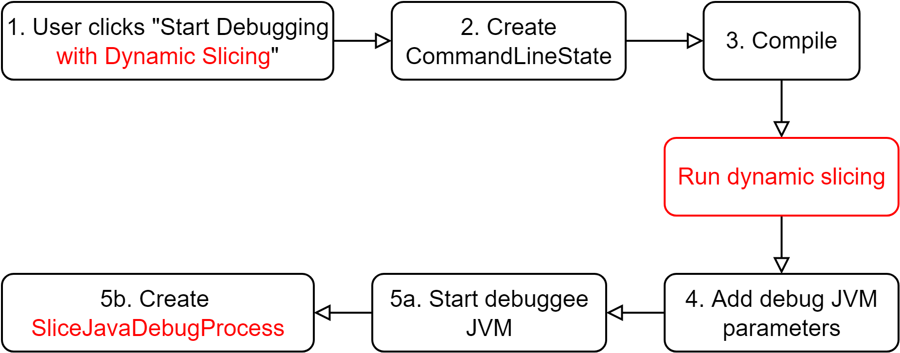

<h1>Slicer4D: Slice-based debugging for IntelliJ</h1>

This plugin integrates dynamic slicing into the existing IntelliJ IDE Debugger. 

PS: This tool is only accurate for deterministic programs 

## 1. Prerequisites

[//]: # (- Ensure that you have [Graphviz]&#40;https://graphviz.org/&#41; installed.)
- We recommend gaining familiarity with slice-based debugging and dynamic analysis. 

## 2. Setup
- Clone this repository. 
- Open it as a new project in IntelliJ IDEA 
- Ensure the 'Run Plugin' run configuration is selected and run it by pressing on the green run button in the toolbar (or by running `./gradlew runIde`).
- IntelliJ will prompt you to create a new project, or will open up an existing project in a new window, which is an IDE instance with the plugin running live. 

## 3. Using Slicer4D
- The first step to using Slicer4D is adding a slicer wrapper. By accessing the configuration menu, you can specify a new wrapper by providing its name and location. The default implementation uses Slicer4J Java slicer. 

- Then, by right-clicking a particular statement, you can specify it as a slicing criterion. Potential additional parameter selection options can appear (e.g., with barrier slicing). When all parameters are selected, the slicing process starts. 

- Once the program slice is computed, the IDE grays out program statements that are not in the slice in the source code viewer.

- The user can manually add breakpoints, or let the plugin automatically add one to the first line of the slice. At this point, one can no longer add breakpoints to non-slice lines, i.e., grayed out lines. 

- The user can start a debugging session by pressing the customized Slicer4D debugger button. 

- One is then able to step through the slice using the customized Slicer4D actions (Step Over, Step Into, Run to Cursor etc.). Additionally, users have access to a customized variable window that only displays variables relevant to the slice.

## 4. Architecture 

### 4.1 `APILayer`
Located at: [src/main/kotlin/ca/ubc/ece/resess/slicer/APILayer](https://github.com/resess/Slicer4D/tree/main/src/main/kotlin/ca/ubc/ece/resess/slicer/APILayer.kt)

`APILayer` provides a standardized communication interface between the IDE and slicer wrappers through the methods below:
- `List<ParameterSpec> getConfiguration()`: gets a list of parameter
specifications required by a slicer. The specification includes
name, extension point (code editor, debugger editor, etc.)  and
type of the parameter (statement or variable); it can be found under `ParameterSpec`. This interface is
used once a slicer provider wants to integrate their new slicer to
the IDE.
- `boolean setSlicingCriterion(Statement, List<Variable>)`: sets the statement and variables selected by the slicer
user as the slicing criteria. It returns true if the slicer successfully sets the criterion
and false otherwise.
- `boolean setParameters(Map<ParameterSpec, List<Value>)`: sets the
values (statements or variables) selected by the slicer user for
each parameter.
- `boolean inSlice(Statement)`: checks if a given statement is in the
slice. This API is used to highlight the statements in the code
view and also enable the breakpoint toggling for slice statements.
- `Statement nextInSlice(Statement)`: given a slice statement as an
input, it retrieves the next statement in the slice. This API is used
to manage the modified stepping commands to skip the next
statement if it is not in the slice.
- `Statement prevInSlice(Statement)`: given a slice statement as an
input, it retrieves the previous statement in the slice.
- `Statement getFirstInSlice()`: returns the first statement in the slice

### 4.2 `HelperWrapper`
Located at: [src/main/kotlin/ca/ubc/ece/resess/slicer/HelperWrapper](https://github.com/resess/Slicer4D/tree/main/src/main/kotlin/ca/ubc/ece/resess/slicer/HelperWrapper.kt)

`HelperWrapper` is an abstract class that provides more flexibility for integrating third-party slicers not originally designed to work with Slicer4D. It implements `APILayer`, and declares the `getSlice()` method, which reads and translates a simple
slice log to the format required by the IDE. 
This method is used to provide default implementations for {`is`,`next`,`prev`,`getFirst`}`InSlice` methods.
Thus, wrappers extending `HelperWrapper` only have
to implement `getSlice()` instead of four slicer navigation methods.

The figure below shows the different ways developers can implement the `APILayer` interface (either directly or through `HelperWrapper`) to create a slicer wrapper:

### 4.3 `DynamicSliceDebuggerRunner`
Located at: [src/main/kotlin/ca/ubc/ece/resess/DynamicSliceDebuggerRunner](https://github.com/resess/Slicer4D/tree/main/src/main/kotlin/ca/ubc/ece/resess/execute/DynamicSliceDebuggerRunner.kt)

This component is for starting a new debugging session. In the original debugger, the `GenericDebuggerRunner` is used for starting debugging sessions. The `DynamicSliceDebuggerRunner`  is a subclass of the original `GenericDebuggerRunner` with has two differences:
- has an extra step for running dynamic slicing. The timing for running dynamic slicing must be after the program is compiled and before the debuggee JVM is started.
- creates `DppJavaDebugProcess` instead of `JavaDebugProcess`. The `DppJavaDebugProcess` object defines our own handlers for handling debug commands.

The figure below summarizes the process to start a debugging session with dynamic slicing in Slicer4D.The difference with the original `GenericDebuggerRunner` is highlighted in red.

### 4.4 `DebugController`
Located at: [src/main/kotlin/ca/ubc/ece/resess/dbgcontroller](https://github.com/resess/Slicer4D/tree/main/src/main/kotlin/ca/ubc/ece/resess/dbgcontroller)

This component is designed to implement skipping of non-slice lines by modifying the behaviour of existing debug actions. It has 3 subcomponents:
- `DppJavaDebugProcess`: for handling the 'Run to Position' action only.

We create a subclass of `JavaDebugProcess`, namely `DppJavaDebugProcess`, and a subclass of `GenericDebuggerRunner`, namely `DynamicSliceDebuggerRunner`. `DppJavaDebugProcess` overrides the original debug action handlers, and `DynamicSliceDebuggerRunner` overrides the `attachVirtualMachine` method to create `DppJavaDebugProcess` instead of `JavaDebugProcess`.

- `DppJvmSteppingCommandProvider`: provides step into and step over commands that skip non-slice lines.

The stepping commands inherit from the original commands but with the difference that they override the `checkCurrentPosition` function. The `checkCurrentPosition` function determines the next step (step again or stop) after the target debugee process has performed a stepping and before the debugger updates the UI and reports back to the user that the stepping command has finished. In Slicer4D, we provide stepping commands that instruct the debuggee to step over again until the current line is in the slice.

- `BreakPointController`: for managing breakpoints that are specific to Slicer4D’s needs. It adds a breakpoint to the first slice line.

### 4.5 `UI`
Located at: [src/main/kotlin/ca/ubc/ece/resess/ui](https://github.com/resess/Slicer4D/tree/main/src/main/kotlin/ca/ubc/ece/resess/ui)

This component consists of 2 submodules:
- `SelectSlicingCriterionAction`: implements the functionality of choosing a line in the program as the slicing criterion for the dynamic slicing, by right-clicking a line in the source-code editor. It selects the line that the mouse is currently on, regardless of any highlighting.
- `EditorSliceVisualizer`: implements 'line graying' of non-slice lines. When the debugging session ends, the original line colours are restored

## 5. Testing
For the unit tests, run `./gradlew test` in the project root directory.

For the integration test, open the Slicer4D repository in IntelliJ IDEA, and make sure you build Gradle correctly. Next, open the test repository by running the `runIdeForUiTest` command. Finally, visit `src/test/java/ca/ubc/ece/resess/dbgcontroller/pages/UITest.java` to run the test.

## 6. Authors and acknowledgment
 

Khaled Ahmed, Mieszko Lis, and Julia Rubin. Slicer4J: A Dynamic Slicer for Java. The ACM Joint European Software Engineering Conference and Symposium on the Foundations of Software Engineering (ESEC/FSE), 2021. <bibtex>

## 7. Ideas for Future Development 
- Add default support for more slicers

## Add custom slicer
- Steps:
  - Clone this repository
  - Open Slicer4D as a new project in IntelliJ IDE
  - Implement the APILayer interface directly, or inherit the abstract class HelperWrapper and implement the remaining methods
  - Add your implementation to the 'ca.ubc.ece.resess.wrappers' package, and add its location to the 'ListOfWrapperPaths' class 
  - Select 'Run Plugin' run configuration, run by pressing the green run button in the toolbar
  - An IDE instance will open in a new window with your custom slicer present in the 'Select Slicer' list or Configuration menu
    - You can test your wrapper by manually adding it in the settings (+ button and specify name/location (e.g. ca.ubc.ece.resess.wrappers.Slicer4JWrapper))
  - When the implementation is ready, please submit a pull request to the main repository to make it accessible to other users